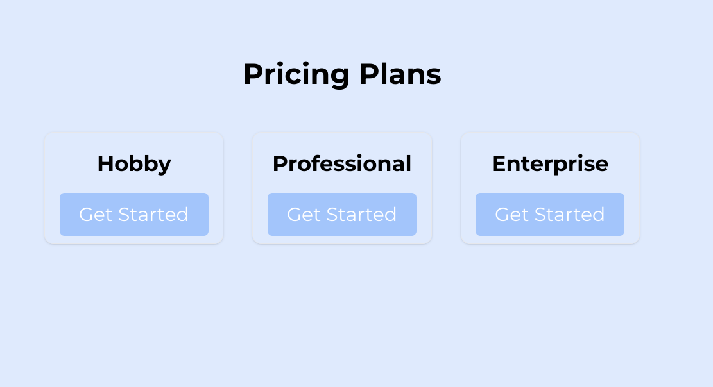

# rails-pay-checkout-demo

## Using Pay with Stripe
**Stripe Checkout,** stripe hosts the payments page.

### Getting Started: Models and Config
1. [stripe.rb](config/initializers/stripe.rb)
1. [pay.rb](config/initializers/pay.rb)
1. [user.rb](app/models/user.rb)

### Pay
#### Tables
`bin/rails pay:install:migrations`

#### payment_processor
By including pay_customer in the User model, the gem internally associates a User with the pay_customer model via the owner_type and owner_id fields.

### Stripe
#### Credentials and Confirmation
Easiest to configure via the [instructions](https://github.com/pay-rails/pay/blob/main/docs/2_configuration.md#configuring-pay) described in the docs. Once you've saved the credentials, you can verify the setup by running `User.first.payment_processor.customer` in rails console.

#### stripe-cli
The [stripe-cli](https://docs.stripe.com/stripe-cli) is used to trigger events and test the webhook integration (locally). Download, install, and setup stripe-cli to work with your account.

### Checkout Process
#### Setup Products and Set Prices
Plans are a deprecated concept. Stripe has introduced [products](https://dashboard.stripe.com/products) and prices. The "price_id" is the relevant field, and it's what is used to generate the checkout url (to direct the user to).

#### Running the CLI
Run `stripe listen --forward-to localhost:3000/pay/webhooks/stripe`

#### Components Involved In Checkout
1. [landing page](app/views/static/home.html.erb)
1. [checkouts controller](app/controllers/checkouts_controller.rb)
1. [development.rb](config/environments/development.rb)
1. [stripe checkouk url generator](app/services/stripe_checkout.rb)

#### Components Involved Success
1. [payment event handler](app/services/payment_succeded_handler.rb)
1. [pay.rb](config/initializers/pay.rb)

#### After checkout
Stripe redirects back to 'success_url' with 'session_id' query param from stripe.

#### Payment Succeed
Using the "stripe.invoice.payment_succeeded" to update user, etc.

## Related Articles
1. [stripe-checkout](https://github.com/pay-rails/pay/blob/3f860ad490ce91b1b1d0ed3d11147d163b9fda80/docs/stripe/8_stripe_checkout.md)
1. [Routes and Webhooks](https://github.com/pay-rails/pay/blob/main/docs/7_webhooks.md)
1. [Stripe Webhooks](https://github.com/pay-rails/pay/blob/main/docs/stripe/5_webhooks.md)
